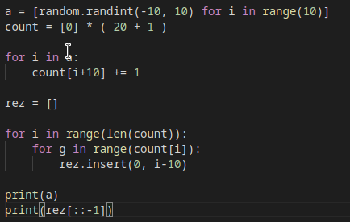
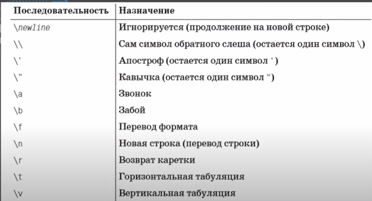

# Варианты исполнения кода на python

1. Интерактивный вариант (консоль Python/Shell)
IDLE - и есть интерактивый вариант. В нем каждая инструкция исполняется моментально 

2. Файловый вариант (стандартный вариант)

# Знакомство с объектами в python

Программа - это набор инструкций, которая описывает компьютеру определенную последовательность действий. 

Программа состоит из инструкций. В свою очередь каждая инструкция создает или обрабатывает объекты. 

Встроенные типы объектов Python


Функция type() позволяет узнать тип объекта

## Числа и операции над ними

### integer

Целое число - число, не содержащее дробной части.

Целые числа - все отрицательные числа, положительные и ноль. 

Функция для преобразования в тип integer - int()

### float

вещественные числа (числа с плавающей точкой) отличаются от целых наличием *дробной части*

Пример: 7.6, 8.0, -5.5

Целая часть отделяется от дробной знаком "точки". 

Функция float() - преобразует данные в вещественный тип. 

### Основные операции


Тонкости в операциях: 
- 2%7 = 2 (7\*0+2(!))
- любые операции с вещественным числом возвращают вещественное число 


Некоторые встроенные функции по работе с числами: 


abs - модуль. функция, которая отбрасывает знак
pow - возводит первое значение в степень второго
round - округление до целого числа ( round(число, до какого разряда)), можно задавать отриц значения, тем самым, например, округлив по десятки. при этом 3.5 -> 4


Все математические функции находятся в модуле math.

# Переменные в питоне. Оператор присваивания. 

Переменная - именованная область памяти, предназначенная для хранения значения. 
= - оператор присваивания. 

Чтобы создать переменную, нужно положить в нее значение. То есть они создаются в момент первого их присваения. 


Переменная должна начинаться с буквы или нижнего подчеркивания. Питон чувствителен к регистру букв. Также переменные не могут иметь зарезервированное слово в качестве идентификатора. 

Имена функций можно использовать в качестве идентификаторов, но возможность вызова этих функция потеряется. 

Создание переменной: 
а = 4
Есть список переменных и список объектов. 

- Создается объект целого типа со значением 4 
- Затем проверится есть ли переменная а. если нет, то она создается. 
- в переменной а сохранится ссылка на объект. 
Если мы присвоим переменной новое значение то:
- создастся объект вещественного типа со значением 5.4 
- Переменная а уже существует
- В переменную а сохранится новая ссылка, при том старая пропадет.

Динамическая типизация - переменные могут принимать значения любых типов. 


Массовое присваение: a=b=c=1
Множественные присваения: a, b = 2, 7 

# Ввод и вывод данных в питоне. 

Функция input() - считывает значения, которые пользователь вводит в консоль и возвращает его. 

Функция print() - выводит переданные ей значения. 

У нее есть параметр - sep (separate-разделять, separator - разделитеть). По умолчанию он равен пробелу. Чтобы изменить это поведение, нужно последним аргументом указать значение sep='' на произвольную строку, которая будет в качестве разделителя.

Также есть параметр end, который отвечает за то, что будет выводиться после всех значений, в конце. end='\n' - по умолчанию. Передав end новую строку, можно изменить его поведение. 

%s - специальный параметр, который указывается в строке, чтобы подставить туда значения из переменных. 


# Деление нацело и остаток от деления

Если любое число %10 - получим последнюю цифру

**любое число % (10 \*\* n) ** где n - сколько цифр хотим взят с конца. 

Если любое число //10 - уберем последнюю цифру 

**любое число // (10 \*\* n))** - где n - сколько цифр с конца нужно убрать 

# Функции trunc, floor, ceil

Все эти функции находятся в модуле math. 
trunc() - отсекает дробную часть. 
int() - тоже в процессе прообразования отсекает дробную часть. 
floor() - округление вниз. Наибольшее целое число, которое не превосходит нашего вещественного числа. 
ceil() - округление вверх. Наименьшее целое число, которое превосходит наше вещественное число. 
ceil() и floor() возвращают целые числа. 

# Логический тип bool. Операторы сравнения и is 


x%2==0 : True - четное, False - нечетное

x%n==0 : кратность, где x - число, которое кратно n. True - кратно, False - нет. 
x%n!=0 : некратность n. так же можно записать с помощью not x%4==0 

**and, or, not**
**in** - этот  оператор проверяет, является ли значение частью последовательности. Последовательность может быть списком, строкой или кортежем. Есть всего два таких оператора: in и **not in**.

bool() - функция преобразования в bool (любое непустое значение преобразуется в True)

- оператор == проверяет равенство значений двух объектов
- оператор is проверяет идентичность самих объектов. Его используют, чтобы удостовериться, что переменные указывают на один и тот же объект в памяти

Python (CPython, если быть точнее) в целях производительности кеширует короткие строки и малые целые числа, поэтому возможны такие казусы:

```python
str1 = 'hello'
str2 = 'hello'
str1 == str2 # True
str1 is str2 # True

str1 = 'hello, my crazy world'
str2 = 'hello, my crazy world'
str1 == str2 # True
str1 is str2 # False

```

# Строки и операции над ними

строки - ' ' или " "'
Многострочные строки - ''' ''' 

\n - перенос строки 
\t - табуляция 

'string' + 'second_string' - 'stringsecond_string' (конкатенация строк)
"a" * 5 - 'aaaaa' (умножение строк)

str() - преобразование в тип str

len() - длина строки, возвращает тип int 

с помощью **in** можно проверить есть ли какая то подстрока в нашей строке. 

Питон сравнивает строки посимвольно по коду букв. 'r'>'abc'
Числовое значение буквы можно получить с помощью функции ord().
Эти коды можно загуглить - ascii code table 

# None

None - неопределено

## Индексы и срезы 

Строка - **упорядоченная** коллекция символов. 
То есть каждый символ имеет свой индекс. 

Чтобы обратиться к каким либо символам строки через индекс, нужно указать его в []. 
строка[номер индекса]
'Hello'[1] -> e

string[len(string)-1] - чтобы получить последнюю букву. ИЛИ string[-1]

Срез - строка[С какого индекса брать:ДО какого брать]
В срезе можно не указывать один из индексов (правый или левый): 
string[4:] - с 4 до конца
string[:6] - с начала ДО 6
string[:] - вся строка 
Чтобы указать шаг нужно: string[::шаг]

Строка *неизменяемый* объект - то есть присвоить значение по индексу не получится. 
Но можно создать новую строку с помощью срезов и конкатенации. 

## Методы строк 

Метод - функция, которая связана с определенным типом объекта. То есть методы являются специфичными для каждого отдельного типа. 

Вызов метода: объект.метод(аргументы)

**Также есть цепочки вызовов методов: ** объект.метод().метод().метод()

s.upper() - метод, который ВОЗВРАЩАЕТ строку, где все ее буквы заглавные
s.lower() - метод, который ВОЗВРАЩАЕТ строку, где все ее буквы строчные

s = s.upper() - чтобы сохранить изменения

s.count('str', [начальный индекс, [конечный индекс]]) - подсчитывает сколько раз встретилась подстрока 'str' в строке s

s.find('str', [начальный индекс, [конечный индекс]]) - ищет индекс подстроки 'str'
s.rfind('str') - ищет индекс подстроки 'str' с конца

s.index('str') - возвращает индекс указанной подстроки
s.replace('o', '', количество замен) -  заменяет подстроку на другую (можно убрать пробелы в строке или удалить некоторые буквы)
s.isalpha() - возвращает True, если строка состоит целиком из букв
s.isdigit() - возвращает True, если строка состоит целиком из цифр
s.rjust(n, 'ОДИН символ заполнителя') - строка "прижимается" к правому краю и следовательно ПЕРЕД ним добавляется некоторое количество знаков заполнителя до того момента, когда длина строки будет равна n.  
s.ljust()

s.split('разделитель') - Разбивает строку по пробелам (по разделителям) и добавляет подстроки в список. 

связующий знак(разделитель).join(список строк)


s.strip() - удаляет знаки пробелов и служебные знаки(переносы строк)
s.rstrip() - удаляет справа знаки пробелов и служебные знаки(переносы строк)
s.lstrip() - удаляет слева знаки пробелов и служебные знаки(переносы строк)

# Форматирование строк

## метод format

Позиционное форматирование строк: 
print('text {0} text text {1} text text text {2}').format(value1, value2, value3) 
переменные в аргументе метода format нумеруются от 0 до n. Эти номера подставляются в строку в фигурных скобках. 

Именованное форматирование строк: 
a, b, c = 1, 2, 3
print('text {value1} text text {value2} text text text {value3}').format(value1=a, value2=b, value3=c) 

## f-строки

a, b = 1, 2
print(f'text {a.lower()} text text {b\*2} text {abs(-45)} text') - нужно поставить перед форматируемой строкой букву f и заключить названия переменных или инструкции в строке в фигурные скобки. 

# Списки и операции над ними

Список - упорядоченная коллекция элементов. Они позволяют хранить взаимосвязанные данные. 

[элемент, элемент, элемент] - список
Элементы могут быть любых типов.

len() - возвращает количество элементов в коллекции.

Сцепление списков: 
[a, b] + [c ,d] = [a, b, c, d]

Добваить элемент в конец: 
список = список + другой список

Добавить элемент в начало: 
список = другой список + список

Дублирование списков: 
[1, 2, 3] * 2 = [1, 2, 3, 1, 2, 3]

a = 'Hello'
list(a) -> ['H', 'e', 'l', 'l', 'o']

Проверка вхождения: 
значение in список -> True или False 

Если список состоит целиком из чисел, то вы можете:
max()
min()
sum()

sorted(список) - возвращает отсортированный список по возрастанию (по умолчанию)
Параметры: reverse=True - по убыванию 

Сравнение списков: 
Списки сравниваются поэлементно, то есть [3] > [2, 3, 1] -> True
список == список -> True , если в списке одинаковое количестко идентичных элементов. 

Среднее арифметическое списка: 
sum(список)/len(список)

**Распокование переменных **
a = [1, 2, 3]
b, c, d = a -> b = 1, c = 2, d = 3

## Списки: индексы и срезы

список[номер индексы] - обращение к элементу

Индексы от 0 до n, либо от -1 с конца до -n

Срез: список[ОТ какого индекса, ДО какого индекса]
При срезах можно указывать те значения индексов (напрмер очень большие), которых на самом деле нет. 

список[:до какого]
список[с какого:]
список[:]
список[n:n:g] , где g - шаг 

a = [ 1, 2, 3, 4, 5]
print(a[2:999:2])
-> [3, 5]
то есть первый элемент вне зависимости от шага - берется

список[::-1] - перевернуть список задом наперед. 

Список - **изменяемый объект** (в отличии от строк), поэтому по индексу можно поместить туда новое значение.

список[0, 2] = значение, значение - можно менять значения с помощью срезов. 
список[0, 3] = значение, значение


**!!!** Если с помощью среза, назначить как минимум трем элементам два значения, то те элементы, которым не хватило значений - удалятся ( в нашем случае третий).
То есть нескольким элементам, можно назначить только ОТ двух значений. 

С помощью функции del можно удалять значения по индексам. 
del список 
del список[i] 
del список[i:j:k] 

**Важная особенность списков:**
Если a = [1, 2, 3], а b = a, то переменные (которые хранят ссылки на объекты) будут ссылаться на один и тот же объект (**только в случае со списками**), и поэтому при изменении списка в одной переменной, мы изменяем этот же список и в другой. 
Чтобы избежать этой ситуации делать так:
a [1, 2, 3]
b = a[:]
тогда, мы сохраним в переменной b *копию* объекта, и списки в обоих переменных будут меняться независимо друг от друга. 

## Списки и их методы 

Методы в строках лишь *возвращают измененную строку*, но не меняют ее. В списках же дела обстоят иначе, методы меняют список. 

 append() добавляет *один* элемент с указанным значением в конец списка. 

Никогда не использовать методы, такие как append, с присвоением этой же переменной (как это было в строках): 
a = a.append(n)
иначе, потеряются все значения, будет None. 

 clear() - он очищает список.

 copy() - делает копию списка. (эквивалент список[:]) :
b = a.copy()

 count(значение) - подсчитывает сколько раз встечается определенное значение в списке.

 index(значение, начальный индекс, до какого индекса) - будет проходить по списку и искать индекс этого первого найденного значения. 

insert(индекс, объекст) - вставляет объект в нужное место, а все остальные значения сдвигаются вправо. 

pop() - удаляет значение с конца и возвращает его. 
pop(индекс) - удаляет и возвращает значение по индексу. 

remove(значение) - ищет значение в списке и удаляет одно лишь первое. (выводит исключение, если ничего не находит)
Для удаления всех значений лучше воспользоваться циклом while. 

reverse() - переворачивает список (эквивалент список[::-1])

sort() - сортировка по возрастанию
sort( reverse=True) - по убыванию 
sort(key=function)
эта функция отвечает за то, по какому критерию будет происходить сортировка. По сути сортировка будет происходить по возвращаемому значению, например:
```python
def f(x):
	return x%10
a = [14, 123, 4, 74, 97, 34, 68, 21, 39]
a.sort(key=f) # список будет отсортирован по последней цифре
```

**Функция sorted()** - встроенная, она сортирует любую коллекцию, возвращая список. 

## Вложенные списки

список = [[элемент, элемент], [элемент, элемент], [элемент, элемент]]
список\[индекс вложенного списка][индекс элемента во вложенном списке]

# Условный оператор if

```python
if условие: 
	инструкции
else: 
	инструкции
инструкции
```

Для составных проверок - and, or, not
Отступ для отделения блоков - 4 пробела. 

Вложенность операторов if: 
``` python
if условие: 
	if условие:
		инструкции
	else:
		инструкции
else: 
	инструкции 

#Множественный оператор if: 
if условие: 
	инструкции
elif условие:
	инструкции
...
else: 
	инструкции
```

Строчное условие:
```python
a = инструкция, если условие истино if условие else инструкция, если условие ложно
a = 3 if 3>1 else -1 # 3
```
# Цикл while

Конструкция while:
while условие:
	инструкции в цикле
	...
инструкции вне цикла

Пока *условие* будет верным, инструкции в теле цикла будут выполняться.

Инструкция **break** совершает принудительный выход из цикла. (и обходит блок else)

Инструкция **continue** принудительно завершает  итерацию и заново проверяет условие (перекидывает в начало цикла).  

Инструкция **else**: блок else будет выполняться после всех итерация цикла и только в том случае, когда цикл завершился "сам по себе" (без принудительного выхода).

while условие: 
	инструкции
else: 
	инструкции

# Функция range и итерируемые объекты

range() - помогает сформировать конечную арифметическую прогрессию. 
range - неизменяемый объект. 

range(До какого числа сформировать прогрессию)
range(С какого числа, ДО какого числа)  
range(С какого числа, ДО какого числа, шаг)

старт по умолчанию равен нулю, а шаг 1.

Функция range является итерируемым объектом. 
**Итерируемый объект** это объект, предоставляющий возможность поочередного прохода по своим элементам. 

Если функция range присвоена переменной, то по ней можно обращаться к значениям последовательности по индексам. Индексация начинается с нуля. (все это из за того, что это итерируемый объект)

range формирует пустую последовательность, если передать ей один аргумент - 0, или указать неправильный интервал.

Чтобы увидеть последовательность можно сформировать список из нее с помощью функции list().

Функция iter(итерируемый объект) - создает итератор.
С помощью функции next(итерируемый объект) можно вытаскивать из объекта следующие элементы. Итератор будет сам запоминать, где ( на каком индексе) он остановился. Если вызвать next при том, что элементы закончились, то он выдаст исключение. 
\# next() - функция
\# итерируемый\_объект.\_\_next\_\_() - метод

Цикл for сам вызывает этот метод next() и присваивает значение итерационной переменной. Так же он не выдает исключения, когда переменные закончились. 

# Цикл for

Цикл for в программировании - цикл с известным количеством повторений. 
Но в питоне это наиболее универскальный инструмент, с помощью которого так же можно поочередно обойти все элементы итерируемого объекта. 

for итерационная\_переменная in итерируемый объект : 
	тело цикла

Цикл for поочередно присваивает итерационной переменной все значения итерируемого объекта. 

Самые частые итерируемые объекты - range, строка, список и другие массивы. 

обход списков и строк: 
- по значениям for i in список/строка: 
- по индексам for i in range(len(список/строка))
Последний является более универсальным. 

Вложенные циклы. 
Формат: 
for переменная in объект:
	for переменная in объект:
		инструкции
		while условие: 
			инструкции
	инструкции 

# Множества, тип данных set 

Множество - неупорядоченная коллекция уникальных элементов. (отсутствуют повторяющиеся значения и индексы)

a = {  элемент, элемент, элемент }

a = { 1, 2, 3, 1, 2, 3} - > {1, 2, 3}

set() - преобразует объект в множество (исключает "дубли")
set('abcac') -> {'b', 'a', 'c'} (неупорядоченная коллекция!)

Чтобы создать пустое множество нужно использовать функцию set(). Выглдеть оно будет так    ' set() '. Нельзя создать пустое множество просто поставив {}, ибо в таком случае объект будет являться словарем. 

**Множество может содержать только НЕизменяемые объекты**
( числа, строки, кортежи )

list(set(список)) - убрать все дубли из списка

множество.add(значение) - изменяет сам объект, а не только возвращает его.

ЗАПРЕЩЕНО: a = a.add(элемент). Иначе, как и со списками, потеряем все значения

множество.update(итерируемый объект) - добавляет элементы итерируемого объекта (кроме изменяемых) в множество. 

Множество - **итерируемый объект**, но добавлять его нельзя

**Множество - изменяемый объект, поэтому он работает в плане присвоения одного и того же множества двум переменным и изменении одного из них - так же, как и списки со словарями (изменяемые объекты)**

множество.discard(значение) - удаляет элемент из множества, не выдает исключение, если элемента уже нет во множестве. 
множество.remove(значение) - удаляет элемент из множества, но будет исключение, если элемента не оказалось во множестве. 
множество.pop() - удаляет и возвращает случайный элемент. Если множество пусное, то будет ошибка
множество.clear() - очищает все элементы множества. То есть делает его пустым. 

## Операции над множествами

**Результаты операций над множествами МОЖНО присваивать этим же множествам**

len(множество) - длина

элемент in множество 

множество & множество2 - пересечение -> множество-пересечение

Чтобы присвоить результат пересечения множеств одному из множестве:
a &= c

множество1.intersection(множество2) - возвращает пересечение
множество1.intersection\_update(множество2) - присваивает множество пересечение в множество1. (не присваивать результат переменным)

множество1 | множество2 - объединение множеств
множество1.union(множество2) - тоже объединение
множество1 = множество1.union(множество2)

множество1 - множество2 - вычитание множеств

множество1 ^ множество2 - симметричная разность

Множества можно *сравнивать*: 
множество1 == множество2 - принадлежат ли все элементы одного мн-ва другому мн-ву и наоборот.

множество1 < множество2 - будет ли являться множество1 подмножеством множества2.
также >, >=, <= (подмножество или равно)

# Словари - dict. Операции и методы словаря. 

Словать - неупорядоченная коллекция произвольных объектов с доступом по ключу. (Ассоциативный массив)

словарь = { 
	ключ : значение,
	ключ : значение,      - **используется часто**
	ключ : значение
}

словарь[ключ]

Чаще всего ключ - строка (или любой другой тип данных, кроме изменяемых типов объекта (список, словарь, множество ))
В словаре не может быть два одинаковых ключа. (Сохранится последний из них)
Значением может являться любой тип данных

dict(ключ=значение, ключ=значение) - создает словарь. При таком способе создания ключ обязательно должен быть строкой. 

Ключ можно писать без кавычек, функция сама сделает значения ключей строками.

Также словарь можно создать так: 
dict( [ [ключ, значение], [ключ, значение],[ключ, значение] ] )

словарь.fromkeys( ['a', 'b', 'c'] ) -> {''a" : None , ''b" : None, ''c" : None }
словарь.fromkeys( ['a', 'b', 'c'], значение по умолчанию) -> {''a" : значение , ''b" : значение, ''c" : значение }

переменная = {} - пустой словарь (**часто используется**)
переменная = dict() - пустой словарь

словарь {
	ключ : значение
	ключ : { ключ : значение, ключ : значение}
}

словарь\[ключ][ключ] 

словарь[новый\_ключ] = значение - **добавление новой ассоциации**
словарь[существующий\_ключ] = новое\_значение - **изменение значения ассоциации**

del словарь[ключ] - удаление ассоциации. (возвращает исключение, если такого ключа нет)

ключ (not) in словарь - проверка ключа

for key in словарь: 
	print(key, словар[key])
-> вывод ключа и значения (**цикл проходит словарь по ключам**)

**Словарь работает так же, как и список в случае присваение двум переменным ссылки на один и тот же словарь:**
```python
a = {1:'hi', 2:'world'}
b = a
b[1] = 'another'
# a, b == {1:'another', 2:'world'}
```

**Методы:** 

словарь**.** ...

.clear() - очищает словарь

.get(ключ) - возвращает значение ключа. Отличие: если передать несуществующий ключ, то метод вернет значение None. 
.get(ключ, объект) - возвращает вместо None этот объект.

.setdefault(ключ) - вернет значение ключа, или если его нет - создает его и присвоит значение None. 
.setdefault(ключ, значение) - если ключа нет, то создает его и присвоит это значение (любой объект) 

.pop(ключ) - вернет значение ключа и удалит эту ассоциацию в нем. Вернет исключение, если ключа нет.

.popitem() - удаляет случайную ассоциацию и возвращает ее в виде словаря. Выдаст ошибку при попытке удалить что то из пустого словаря. 

.keys() - возвращает объект типа dict keys -> dict_keys([ключ, ключ, ключ])
цикл for по сути обходит значения по объекту типа dict_keys 

.values() - возвращает объект типа dict values -> dict_values([значение, значение, значение])
С помощью этого метода в цикле for можно пройтись по значениям. 

.items() - возвращает коллекцию в которой содержаться все пары - dic items -> dict_items([(ключ, значение), (ключ, значение), (ключ, значение)])
С помощью цикла for также можно обойти ассоциации. 

**Функция sorted** - встроенная. сортируют любую коллекцию

for key, value in словарь.items():
	print(key, value)

Это работает по принципу множественного присвоение 
a, b = [4, 7] -> a= 4, b = 7

**Где используются словари**: 
- подсчет чего либо (ключ - объект, значение - количество)
- установление соответствия

# Метод подсчета. Сортировка подсчетом

Метод подсчета - реализация чего либо через подсчет объектов.

Сортировка подсчетом заключается в том, что мы, проходя по массиву, подсчитываем сколько раз они встречаются и записываем это в новый массив (массив подсчета). Количество элементов массива подсчета будет зависеть от того, каков диапазон значений в изначальном массиве. В массиве подсчета индексы будут являться числами из старого массива, а значения в них - то, сколько раз они встречаются в старом массиве.


Массивы выглядят так: 


Чтобы создать массив с уже отсортированными числами можно пройтись по всем элементам массива подсчета и вставить в его начало **индексы** элементов столько раз, сколько указано в значении элемента.  


Сортировка списка с отриц числами происходит благодаря смещению индексов в массиве подсчета на n. Где n - модуль минимального отрицательного числа. (в данном случае n - 10)



# Кортежи

Кортеж (tuple) - неизменяемая последовательность, обычно используемая для хранения разнотипных объектов.  

кортеж = ( элемент, элемент, элемент)
кортеж = элемент, элемент, элемент
кортеж = tuple()  ==  кортеж = ()
кортеж = tuple(итерабильная последовательность )

Индексация элементов такая же, как у списков

Изменяемые объекты в кортеже мы вправе изменить. (вложенные в кортеж список например)

Кортежи используются: 
- если необходимо гарантировать неизменяемость объекта
- потому что занимают меньше места в памяти (  служебный метод - .\_\_sizeof\_\_()  - значение в байтах )
- кортежи, как ключи словаря ( списки нельзя так использовать) 
- Кортеж тоже последовательность
## Операции с кортежами

len(кортеж)
оператор (not) in 

Оператор сцепления - кортеж + кортеж - возвращает сцепленный кортеж (порядок операндов важен)

кортеж * 2 - дублирование

min(), max(), sum() - если в кортеже числа

**Срезы** такие же, как у списков.

del кортеж 

## Методы кортежей

.index(значение элемента) - возвращает индекс элемента или ошибку, если такого элемента нет 

.count(элемент) - возвращает число - сколько раз встречался этот элемент.

# Функции

## Определение и вызов

Функция - многократно используемый фрагмент программы. При помощи функций можно объеденить несколько инструкций в один блок, присвоить этому блоку имя и затем, обращаясь по имени этого блока, выполнить инструкции внутри него в любом месте программы необходимое число раз.

def (definition) - ключевое слово для объявления функция 

Определение функции:

def имя блока/функции(): 
	инструкции

 имя функции() - вызов функции

 За счет () происходит обращение к функции. Без них функция ни выполнится. 

 def функция(имя аргумента): 
 	инструкции с аргументом

 Аргументы - позиционные поэтому при def функция(аргумент1, аргумент2) в вызове нужно передавать аргументы так же, как в определении функции.

if условие: 
	def функция():
		инструкции
else: 
	def функция():
		другие инструкции

Если два раза определить одну и ту же функцию, то функция будет перезаписана и сохранится второй вариант. 

Чтобы оставить функция пустой нужно в теле написать инструкцию pass
def abc():
	pass

## Зачем нужны функции

1. Устраняют избыточность кода
2. Обеспечивают декомпозицию проблемы - возможность разбить одну большую задачу на более мелкие задачи. 

## Возвращаемое значение функции. Оператор return

Возвращаемое значение - это значение, которое 'подставляется' на место вызова функции. 

Любая функция в питоне возвращает какое либо значение при помощи оператора return, но если этого оператора нет, то она вернет None

a = функция() - при объявлении переменной, хранящей в себе функцию, функция, кнчн же, сначала выполнится, а потом запишется в переменную. Даже print, которая выведет что либо на экран, а потом вернет None. 

оператор - return значение - возвращает значение и выходит из функции ( как break из цикла)

Вернуть можно любой тип данных

return значение, значение -> ( значение, значение) - кортеж

## Области видимости. Встроенная, глобальная и локальная области видимости. 

Чтобы создать переменную нужно присвоить ей значение. Но от того, **где** будет присвоено это значение будет зависеть то, к какой области видимости будет относится данная переменная. 

Область видимости - место, где было присвоено значение переменной, и где осуществляется поиск по этому имени. Она определяет контекст переменной, в рамках которого ее можно использовать. 

Области видимости:
**Локальная** область видимости создается внутри функции. 
def s():
	#local
	a, b, c = 1, 2, 3    - будут видны только в функции s()

Локальные переменные существуют только в момент работы функции. После того, как функция отработает, переменные удаляются.

Внутри функции невозможно обращаться к локальным переменным другой функции. 

**Глобальная область видимости** - это любые переменные, которые создаются вне функций. Глобальная переменная доступна в любом месте текущего модуля (программе/файле) 

К глобальным переменным можно обращаться внутри функции, но менять их нельзя. Если попробовать "изменить" глобальную переменную, то просто создастся локальная переменная с таким же именем.

Функция id() - возвращает идентификатор переменной

def s():
	print(w)
	w = 'hi'
w = 'hello'
s()
-> ошибка. Потому что несмотря на то, что переменная w уже существовала в глобальной области видимости, питон пробегает по содержимому функции и понимает, что в ней есть локальная переменная с таким же именем и не дает использовать имя этой переменной до ее объявления.

**По месту присвоения переменной питон понимает к какой области она относится.**

def функция(параметр, параметр):
	инструкции			# эти параметры автоматически становятся локальными переменными.

\Глобальные **изменяемые** объекты (такие как списки, словари, множества) могут подлежать изменению в функиях. Чтобы избежать такой ситуации со списками, нужно передавать полный срез списка.

Инструкция **global** позволяет изменить значение глобальной переменной в функции.
def ...:
	global глобальная переменная
	изменяем глобальную переменную

Всё вышеперечисленное работает также и с **функциями**, ибо у функций тоже есть имена. Первый уровень функция доступен в глобальной области видимости.

**Встроенная область видимости.**
В эту область видимости входят все встроенные функции, объекты и переменные. Чтобы ее увидеть в пайчерме нужно нажать ctrl + пробел. ( на против встроенных функций и ключевых слов будет стоять слово builtins)

Имена из встроенной области видимости, за исключением ключевых слов, можно переопределить. При чем как в глобальной, так и в локальной области видимости.

print(abs(-7)) -> 7
def w(a):            
	return a**2    / или сразу def abs:
abs = w             
print(abs(-7)) -> 49 


-> 
hello q
200 s

**Правило поиска имен** в питоне.

Существуют:
- встроенное пространство имен
- глобальная область видимости
- локальная область видимости (объемлющие и локальные)


Порядок поиска имени: 
1. Локальная область видимости
2. Объемлющая
3. Глобальная
4. Встроенная


->
hello
hello

Чтобы из локальной функции изменить значение переменной в объемлющей функции необходимо использовать конструкцию nonlocal. То есть в локальной функции мы говорим, что берем нелокальное значение какой либо переменной. А следовательно берем из объемлющей. Инструкция nonlocal используется только во вложенных функциях и не работает с глобальной областью видимости.

## Передача аргументов 

Передача аргументов - передача объектов внутрь функции во время ее вызова.

При добавлении в функцию параметров "def функция(параметр, параметр):" в ней автоматически создаются локальные переменные с именами параметров.

*В момент передачи аргументов в вызываемую функцию автоматически происходит присваение значений из аргументов локальным переменным из параметров функции.*

Если в аргумент функции передается глобальный объект, то в ней будет локальная переменная, которая ссылается на тот же самый объект, что и хранящая его глобальная переменная: 


**Позиционная передача аргументов**:
def функция(параметр1, параметр2, параметр3):
	инструкции
функция(аргумент1, аргумент2, аргумент3)

Все параметры в этом случае являются обязательными (ни больше, ни меньше).

**Передача аргументов по имени**:
def функция(параметр1, параметр2, параметр3):
	инструкции
функция( параметр2=аргумент2, параметр1=аргумент1, параметр3=аргумент3)

При таком варианте передачи нужно строгу соблюдать имена параметров. Порядок передачи аргументов не важен.

**Комбинированный вариант**: 
```псевдокод
def функция(параметр1, параметр2, параметр3):
	инструкции
функция(аргумент1, параметр3=аргумент3, параметр2=аргумент2)
```

В таком варианте можно некоторые аргументы передавать позиционно, а другие по именам. 
Сперва нужно указывать позиционные аргументы, строго соблюдая их порядок в параметрах, а только после них по именам, где порядок оставшихся аргументов не важен.

При объявлении функции некоторым параметрам можно присвоить **значения по умолчанию** и тем самым сделать их необязательными: 
```псевдокод
def функция(параметр1, параметр2, параметр3=значение по умолчанию):
	инструкции
функция(аргумент1, аргумент2) 
функция(аргумент1, аргумент2, аргумент3)
```
Значение по умолчанию в скобках должны отделяться от обяхательных и быть во сторой части: *функция(параметр1, параметр2, параметр3=значение по умолчанию, параметр4=значение по умолчанию*). То есть обязательные параметры не могут стоять после параметров со значениями по умолчанию.

## Передача аргументов: \*args и \*\*kwargs

Оператор звездочка принимает в качестве операнда переменную или объект , в которую **запаковывает** лишние значения, или который **распоковывает** по переменным. Также он может принимать функцию
**\*объект/переменная/функция**
Группа лишних переменных возвращается в виде списка.

```python
*a, b, c = [1, 2, 3, 4, 5, 6, 7, 8, 9, 10]
# a = [1, 2, 3, 4, 5, 6, 7, 8]; b =  9; c = 10.
```
При множественном присваивании оператор звездочка должен быть только один.

Так же оператор звездочка может защищать от нехватки значений при присваении.
```python
*a, b, c = [1, 2]
#В этом случае в переменной a будет пустой список. 
```

Также оператор \* может распоковывать значения **из** объектов в переменные.
```python
s = [4, 10]
print(list(range(*s))) # [4, 5, 6, 7, 8, 9]
```

```python
def f(a, b, c, d):
	print(a, b, c, d)
a = (1, 'hello', True, [3,7,8])
f(*a) 
#Здесь оператор звездочка распакует кортеж по аргументам
```

**Оператор звездочка при определении функции**
**args**
```python
def f(*args):
	print(args, type(args))
f(1, 2, 3, 4, 5) # (1,2,3,4,5) class 'tuple'
f() # () class 'tuple'
```

Если указать оператор звездочка в параметре функции, то все переданные при вызове аргументы упакуются в нее. То есть при помощи него в функцию можно передать n-ое количество неименованных аргументов.
```python
def f(a, *args, c):
	pass
f(1, 2, 2, 2, c=3) # после параметра args не может быть позиционных аргументов. После него можно передавать аргументы только лишь по имени. 
```

Обычно для такого параметра используют имя *args*

**kwargs**
При помощи оператора \*\*kwargs можно передавать в функцию аргументы по имени в неопределенном количестве:

```python
def f(**kwargs):
	pass
f(a=1, b=4, c=6)
#При чем локальная переменная kwargs примет значение в виде словаря: 
#{'a':1, 'b':4, 'c':6}
```

**Комбинирование args и kwargs**

```python
def f(*args, **kwargs):
	pass
```
При этом сначала нужно будет указывать позиционные аргументы args, а затем kwargs

*Фишка*
```python
a = [1, 2, 3]
print(a) # [1,2,3]
print(*a) # 1 2 3
```

## Изменяемые объекты в качестве значений по умолчанию в функции

*Не использовать изменяемые объекты в качестве объектов по умолчанию (если такое поведение не необходимо) :*

```python 
def append_to_list(value, my_list=[]):
	my_list.append(value)
	print(my_list)
append_to_list(77) # [77]
append_to_list(99) # [77, 99]
append_to_list(111) # [77, 99, 111] - все это несмотря на значение по умолчанию

# А чтобы сделать так, чтобы значения добавлялись в новый пустой список, нужно написать: 

def append_to_list(value, my_list=None):
	if my_list is None:
		my_list = []
	my_list.append(value)
	print(my_list)
```

**Так же работает со словарем и тп** 

## Вложенные функци
https://www.youtube.com/watch?v=TKv0c-Tyyuk&list=PLQAt0m1f9OHvv2wxPGSCWjgy1qER_FvB6&index=64&ab_channel=egoroff_channel

# Рекурсия в питоне

Рекурсия в программировании - вызов функции самой себя.

У рекурсии должен быть выход - какое то условие, при выполнении которого функция переставала бы вызывать себя.

Чтобы воспользоваться рекурсией для решения задачи нужно:
1. Задача должна иметь такой набор данных, для которого есть простое решение - выход из рекурсии. (как например 1! = 1)
2. Задача должна иметь возможность сводиться к более мелкой - подзадаче.

# Функция enumerate

Функция enumerate принимает коллекцию и возвращает итерируемый объект типа enumerate. 
```python
a = [10, 20, 30, 40]
print(list(enumerate(a))) #[(0,10), (1,20), (2,30), (3,40)]
```
Вывод: функция enumerate генерирует последовательность элементов в виде кортежей, в которых на первом месте стоит число от 0 до n, а на втором элемент изначальной коллекции.

Очевидно, что объект типа enumerate можно обходить в цикле for. 

for кортеж in enumerate(итерируемая последовательность):
	pass

for индекс, значение in enumerate(итерируемая последовательность):
	pass

*enumerate(коллекция, начальное значение нумерации)* 

```python
print(list(enumerate(['a','b', 'c'],10))) #[ (10,'a'), (11,'b'), (12, 'c') ]
```

# Lambda фукнции

lambda функции - функции не имеющие имени, анонимные функции

Для создания такой функции есть ключевое слово *lambda* 

**Синтаксис**:
lambda аргументы : возвращаемое выражение

```python
r = lambda x: x**2
print(r(7)) #49
```

Так как у анонимной функции нет имени, по которому можно было бы к ней обращаться, то нам нужно например присовить эту функцию переменной.

lambda используется тогда, когда есть необходимость в функции, которая выполняет лишь одно действие/инструкцию.

Пример
```python
a = lambda : 'hello' #функция не принимающая никаких аргументов
```

В lambda не может быть циклов.
Но могут быть условные операторы:
```python
def f(x):
	if x>0:
		return 'positive'
	else:
		return 'negative'

t = lambda x: 'positive' if x > 0 else 'negative' # идентичные функции
```

Сортировка списка с помощью анонимной функции:
```python
a = [14, 123, 4, 74, 97, 34, 68, 21, 39]
a.sort(key=lambda x: x%10) # список будет отсортирован по последней цифре
```

Примеры использования:
```python
def linear(k,b):
	return lambda x: x*k+b
graf1 = linear(2,5)
print(graf1(3)) # y = x*2+5, где x = 3

f = lambda k, b: lambda x: k*x+b
graf1 = f(2,5)
print(graf1(3)) # то же самое только с лямбда
```
**Условный оператор в lambda** 
слова *elif* в лямбда нет, но можно использовать вложенный if  
```python 
d = lambda x: 'Hello' if x > 100 else ('world' if x > 0 else 'hi')
```

# Функция isinstance

Эта функция позволяет проверить к какому типу объектов относится значение.

```python
isinstance(значение, тип ) 

if isintance('hello', str): # Вернет True
	pass
	
if isintance(2.5, (int, float)): # Вернет True
	pass
```

# Генераторы списков

```python
# [выражение for i in коллекция]
a = [i**2 for i in range(5)]
```
Изменение списков с помощью генераторов:
```python
a = [1, 2, 3, 4, 5]
a = [elem+1 for elem in a]
```
Условия в генераторах списков:
```python
a = [i for i in range(10) if i%2==0]
# Нельзя писать:
# a = [i for i in range(10) if True else i**2 for i in range(10)]

# Но можно вот так:
a = [12, 8, 56, 1, 33, 102, 5]
b = [ i**2 if i > 10 else i/2 for i in a]
```
Вложенные циклы в генераторах: 
```python
a = [(i,j) for i in 'abc' for j in [1,2,3]]
# Каждое значение сочетается с каждым
```

## Вложенные генераторы списков 

```python
# [[выражение for i in коллекция] for i in коллекция]    
```

# Генераторы и итераторы. Выражение-генераторы

**Генератор** - итератор, элементы которого можно итерировать только один раз.

```python
a = (выражение генератора)
```

**Итератор** - объект, который поддерживает функцию next(). Помнит о том, какой элемент будет браться следующим.

**Итерируемый объект** - объект, который предоставляет возможность обойти поочередно свои элементы. Может быть преобразован к итератору.

Функция iter(итерируемый объект) - преобразует итерируемый объект в итератор.

```python
s = [1,2,3] #итерируемый объект, который не поддерживает функцию next()
d = iter(s)
next(d) # 1
next(d) # 2
next (d) # 3
next(d) # ОШИБКА
```

*Генератор по умолчанию является итератором*
Как сделать генератор:

```python
b = (i**2 for i in range(1,6)) # чтобы создать генератор, нужно обрамить цикл for с выражением в круглые скобки
print(next(b)) # 1
print(next(b)) # 4
print(next(b)) # след элемент и тд.
```

**Также генератор можно обойти в цикле for, но только один раз. При том при второй попытке обойти генератор в цикле for ошибки, в отличии от функции next(), не будет. **

Точно так же это работает с некоторыми функциями, которые обходят элементы коллекции:
```python
b = (i**2 for i in range(1,6))
print(sum(b)) # 55
print(sum(b)) # 0 
# !!! Генератор можно обойти только один раз
```

Все элементы генератора не хранятся в памяти как единая коллекция, они формируются на лету при обходе в цикле или при помощи функции next(). Например, при применении next() будет сформирован следующий элемент, а предыдущий не сохранится в памяти. Эта и является смыслом использования генераторов.

```python 
a = list(range(10000000000)) # memory error
a = [i for i in range(10000000000) # тоже memory error]

c = (i for i in range(1000000000000))
for i in c:
	print(i) 
# а с генератором все работает,потому что он не хранит все элементы
```

```python
a = (i/2 for i in range(1,6))
list(a) 
# идентично с:
b = [i/2 for i in range(1, 6)]
```

**!!!** 
- К выражениям генератора нельзя применять фукнцию len(), так как генератор - не коллекция.
- К генераторам нельзя обратиться по индексам.

## Функции генераторы. Yield

**Функции генераторы** - возвращают по одному значению, замораживают свое выполнение и при новом вызове продолжают с того места, где остановились. Они преобразуют функцию к генератору.

```python
def genf():
	for i in [1,2,3]:
		yield i
s = genf() # объект типа генератор
next(s) # 1
next(s) # 2
next(s) # 3
next(s) # ошибка stopiteration

for i in genf():
	print(i) # Обход функции-генератора в цикле
```

Инструкция **yield** возвращает значение и замораживает функцию со всеми локальными переменными на месте заморозки. 

**!!!** При повторном обращении к функции-генератору функция начнет выполняться со следующей строчки после инструкции yield.

```python
def genf():
	s = 7
	for i in [1,2,3]:
		yield i
		print(s)
		s = s * 10 + 7
g = genf() 
next(g) # 1
next(g) # 7 2
next(g) # 77 3
```

Практический смысл функции-генератора - экономия памяти. По тем же причинам, что и у обычного генератора. 

# Фукнция map

**Функция map** - принимает функцию, а затем итерабильную последовательность и возвращает объект типа *map*. Этот объект представляет собой итератор, который вычисляет результат работы переданной функции на каждый агрумент из переданной последовательности.

```python
a = [-1, 2, 3, -4, 5]
b = map(abs, a) # map object

b = list(map(abs, a)) #  [1, 2, 3, 4, 5]
# Идентично с:
b = [abs(i) for i in a] # [1, 2, 3, 4, 5]
# Идентично с:
def mymap(func, coll):
    for i in coll:
        yield func(i)
b = list(mymap(abs, [-1,-2,3])) # [1,2,3]
```

Применение:
```python
a = ['hello', 'hi', 'good mornng']
b = list(map(len, a)) # [5, 2, 12] 
b = list(map(str.upper, a)) # ['HELLO', 'HI', 'GOOD MORNING']
# Методы применяются по объектам. Например, объект str - встроенный объект

b = list(map(lambda x: x[::-1], a)) # Строки наоборот ['olleh', 'ih', 'gnnrom doog']
```

**!!!** Всё, что можно сделать с помощью функции map можно сделать с помощью генератора списков.

```python
# Как считать значения введенные через пробел в input
s = list(map(int, input(),split())) 
# Ввод: 1 23 56 21 -> [1, 23, 56, 21]
```

# Функция filter

**Функция filter** - принимает функцию и итерабильную последовательност, возвращает итератор типа filter, в который войдет только те элементы итерабильной коллекции, в которых функция вернет True. То есть переданная функция должна возвращать булево значение. 

Например:
```python
a = [12, 8, 0, 56, 1, 33, 102, 5, 0]
b = list(filter(lambda x: x > 9 and x < 100, a)) # Оператор условия сам по себе возвращает булево значение. 
# В b будет список двузначных чисел 

b = list(filter(bool, a)) # Убирает все пустые значения - 0, '', [] и тд

# Также вместо функции можно передавать значение None (так в документации) и это будет равнозначно выражению выше. То есть возьмутся те значения, которые не являются пустыми.

```

**!!!** Также, разумеется, первым аргументом можно передавать встроенные и самописные функции, методы объектов. (Главное без оператора вызова и при том, чтобы все они возвращали булево значение)

```python
a = '41238saflkzxcvkl4GLJSf'
b = list(filter(str.isalpha, a)) # список только с буквами 
```
Фильтрация словарей по значению:


Таким же образом можно фильтровать и списки.

# Функция zip 

**Функция zip** - принимает в себя произвольное количество коллекций и возвращает итератор типа zip. В котором каждый элемент будет представлять собой кортеж из элементов в коллекциях на n-ном индексе.

```python
a = [111, 222, 333, 444]
b = ['a', 'b', 'c', 'd']
for i in range(4):
	print(a[i], b[i])
# 111 a 
# 222 b
# 333 c 
# 444 d

# Идентично с:
rez = zip(a, b) # zip object
rez = list(zip(a, b)) # [(111, 'a'), (222, 'b'), (333, 'c'), (444, 'd')]
```

Количество элементов в итераторе будет равно количеству элементов в наименьшей переданной коллекции:
```python
a = [5, 6, 7]
b = [100, 200, 300, 40]
rez = list(zip(a, b)) # [(5, 100), (6, 200), (7, 300)] 
# "Лишние" элементы просто не возьмутся в объект zip
```

Разные коллекции не проблема:
```python
a = 'abcd'
b = [1, 2, 3, 4]
c = {
	10:100,
	20:200,
	30:300
}
rez = list(zip(a, b, c)) # [('a', 1, 10), ('b', 2, 20), ('c', 3, 30)]
for t1, t2, t3 in zip(a, b, c):
	pass
```

**!!!** Важно помнить:
- что нельзя находить длину len() итератора
- что нельзя обращаться к нему по индексам и срезам a[1]
- что элементы можно итерировать один раз

Как обратно получить коллекции после результата работы zip:
```python
a = [5, 6, 7, 8]
b = [100, 200, 300, 400]
c = 'abcd'
rez = zip(a, b, c)
col1, col2, col3 = zip(*rez) # Получаем наши изначальные коллекции обратно, только без "лишних" элементов в них
```

# Метод sort и функция sorted

**sort** - метод списка(!), который сортирует список, сравнивая элементы между собой, по возрастанию (по умолчанию). Этот метод меняет сам список и возвращает None. 

**sorted** - встроенная функция для сортировки коллекций. Принимает итерабильную последовательность, затем key и reverse. Возвращает отсортированный по возрастанию список (по умолчанию).

```python
a = [3,1,2]
b = 'hello'
c = ('hi', 'zero', 'abracadabra', 'pikachu')
print(sorted(a)) # [1,2,3]
print(sorted(b)) # ['e','h','h','l','o']
print(sorted(c)) # ['abracadabra', 'hi', 'pikachu', 'zero']
```

Обе из сортировок принимают два необязательных именованных аргумента:
```python
c = sorted(c, key=function, reverse=bool)
c.sort(key=function, reverse=bool)
# По умолчанию reverse = False, поэтому элементы сортируются в порядке возрастания. Если он будет True, то элементы будут отсортированы в порядке убывания.
```

**!!!** *При использовании любой из сортировок важно помнить, что коллекция должна состоять из элементов, которые поддерживают операцию сравнения. 
```python
a = [1, 'a', []]
print(sorted(a)) # ошибка сравнения
```

## Сортировка по ключу key

В аргумент key у функции sorted и метода sort передается функция или метод по возвращаемому значению которых будет происходит сортировка.
```python
# 1 встроенная функция
a = [ 4, -10, 43, -300, 54, 289, -34, -8, 749]
print(sorted(a, key=abs))

# 2 собственная именованная или анонимная функция
a = [ 4, 10, 43, 300, 54, 289, 34, 8, 749]
print(sorted(a, key=lambda x: x % 10))

# а вот так можно сортировать по двум критериям:
a = [ 4, 10, 43, 300, 54, 289, 34, 8, 749]
print(sorted(a, key=lambda x: (x % 10, x//10%10)))
# то есть просто передавая кортеж в возвращаемое значение

# встроенные методы объектов
a = ['ZZZ', 'aaa', 'eee', 'DDD']
print(sorted(a, key = str.lower))
```

# Методы split и join 

**split** - метод строки, который по умолчнию разбивает строку по пробелам/переносам/табуляциям и тп и возвращает список, элементами которого являются строки, получившиеся в результате разбиения по подстроке. Можно изменить разделитель, передав строку в аргумент.

```python
a = 'Hello\nworld\tim ilya'
a.split() # ['Hello', 'world', 'im', 'ilya'] 
print(a.split(' ')) # ['Hello\nworld\tim', 'ilya']

a = 'Ivanov Ivan Ivanovich'
a.split('I') # ['', 'vanov ', 'van ', 'vanovich']
s = 'aaa'
s.split('a') # ['', '', '', '']
```

**join** - метод строки, который применяется к строке, которая будет соединять элементы переданного в аргумент списка в одну строку. (**!**) Список должен состоять из элементов типа str.

```python
s = ['43', '54', '32', '65']
'#'.join(s) # 43#54#32#65
''.join(s) # 43543265
'...\n'.join([ str(i) for i in s ]) # важно помнить, что список должен быть из строк
```

# Экранированные символы (служебные)

Служебные символы - символы, записанные специальным образом, которые при выводе преобразуются во что либо или выполняют какую либо надлежащую им функциональность. 

```python
a = 'str\nbr'
print(a)
# str
# br
len(a) # 6 
# Вывод: питон воспринимает служебные символы за один символ.
```

\n - перенос строки
\t - табуляция 



**!!!** Когда питон встречает в строке обратный слеш, то он ищет соответствующий служебный символ, поэтому никакую строку нельзя просто закончить обратным слешем
```python
a = 'ssa\' # ошибка
```

```python
a = r'\nasd\tasdf\\' # автоматически убирает все служебные символы в строке
```

# Установка сторонних модулей 

**Внешний модуль** - программа .py написанная другим программистом и хранящаяся в репозиториях pypi.org

**1 способ - PIP**
PIP - пакетный менеджер питона
pip3 - в линукс
pip3 freeze/ pip3 list - позволяет посмотреть установленные модули
pip3 install <имя\_модуля\_>
pip3 install <имя\_модуля\_>==версия 

на сайте pypu.org можно искать модули по определенной тематике (vk, youtube)

Чтобы установить несколько модулей за раз, нужно создать файл requirements.txt в который записать имена интересующих модулей (мб с версиями через ==) и написать команду:
pip install -r requirements.txt

pip uninstall <имя\_модуля\_> - удаление модуля

**2 способ** - PyCharm 
File > Settings > ProjectInterpreter > Плюсик в нужном интерпретаторе питона
В терминале из пайчарма

# Функции all и any

Способы преобразовать любой объект к логическому типу:
- bool()
- not not

Если переданное значение пустое - False, в противном случае True. (0 - пустое)

Функции all и any нужны для того, чтобы проверить объект на заполненность или пустоту.

**Функци all** принимает в аргумент коллекцию, пробегается по всем ее элементам, преобразуя их в тип bool и возвращает True, если все элементы коллекции вернули True.

**Функция any** принимает в аргумент коллекцию, пробегается по всем ее элементам, преобразуя их в тип bool и возвращает True, если хотя бы один из элементов коллекции будет являться непустым, то есть вернет True.

```python
# Функции all и any полезны, когда нужно проверить несколько условий одновременно 
a = 99
condition_1 = a % 2 == 0
condition_2 = a > 50 
condition_3 = a < 1000 
all([condition_1, condition_2, condition_3]) # False
any([condition_1, condition_2, condition_3]) # True
```

# Виды вызываемых объектов

**Вызываемый объект** - тот объект, к которому можно применить оператор вызова.

() - оператор вызова

callable(объект) - возвращает True, если объект является вызываемым
callable(объект.метод) - нельзя передать метод без объекта

Вызываемые объекты: 
- Встроенные функции (len, abs и тд)
- Встроенные методы объектов ( sort, append )
- Самописные функции (именованные и анонимные)
- Классы
- Экземпляры класса (магический метод \_\_call\_\_ в классе)
- Методы класса
- Функции-генераторы

# Функции первого класса 

В Python все функции являются объектами первого класса. Это означает, что Python поддерживает:
- передачу функций в качестве аргументов другим функциям
- возвращение функции как результата других функций
- присваивание функций переменным
- сохранение функций в структурах данных

```python
# передача функции в качестве аргумента другой функции
list(map(str, [1,2,3])) # ['1', '2', '3']
```

```python
# Функция delay ожидает как аргумент задержку в секундах, другую функцию и ее аргументы:
import time
def delay(seconds, func, *args, **kwargs):
	print(f'Delay {seconds} seconds...')
	time.sleep(seconds)
	return func(*args, **kwargs)
# Теперь функции delay можно передавать любую другую функцию как аргумент и она выполнится после указанной паузы:
delay(5, summ, 1, 4)
# Delay 5 seconds...
# 5
```

Сохранение функций в структурах данных:
```python
functions = [delay, summ]
functions # [<function __main__.delay(seconds, func, *args, **kwargs)>,<function __main__.summ(a, b)>]
```

Присваивание функций переменным:
```python
delay_execution = delay # <function __main__.delay(seconds, func, *args, **kwargs)>
delay_execution(5, summ, 1, 4)
# Delay 5 seconds...
# 5
```

# Замыкания

**Замыкание** (closure) — функция, которая находится внутри другой функции и ссылается на переменные объявленные в теле внешней функции (свободные переменные). Внутренняя функция создается каждый раз во время выполнения внешней, то есть происходит создание  нового экземпляра внутренней функции, с новыми ссылками на переменные внешней функции.

**closures** -это функции с прикрепленными данными.

```python
def multiply(num1): # Пример замыкания
    var = 10
    def inner(num2):
        return num1 * num2
    return inner
# Замыкание - функция inner. Она использует внутри себя num1, поэтому эта переменная будет запомнена в отличии от var.

mult_by_9 = multiply(9) # Переменная mult_by_9 ссылается на внутреннюю функцию inner и при этом внутренняя функция помнит значение num1 = 9 и поэтому все числа будут умножаться на 9:
mult_by_9(10) # 90
mult_by_9 # <function __main__.multiply.<locals>.inner(num2)>
```

```python
def func1(value):
	a = 1
	b = value
	c = [1, 2, 3]
	def func2():
		nonlocal a
		c.append(4)
		a += 1
		return a, b, c
	return func2
# чтобы изменять свободные переменные нужно использовать инструкцию nonlocal ( в случае с неизменяемыми объектами)
```

Функция в качестве аргумента в замыкание:
```python
def add(a, b):
	return a+b
def counter(func):
	count = 0
	def inner(*args, **kwargs):
		nonlocal count
		count+=1
		print(f'функция {func.__name} вызывалась {count} раз')
		return func(*args, **kwargs) # Пробрасываем аргументы
	return inner
q = counter(add)
q(10,20) 
# функция add вызывалась 1 раз
# 30 
q(3, 4)
# функция add вызывалась 2 раз
# 7
```

```python
# НЕПОНЯТНЫЙ МОМЕНТ:
def func_as_object(a,b):
    def add():
        return a+b
    def sub():
        return a-b
    def mul():
        return a*b
    def replace():
        pass
    replace.add = add
    replace.sub = sub
    replace.mul = mul
    return replace

obj1 = func_as_object(5,2)
obj1.add() # 7
obj2 = func_as_object(15,2) 
obj2.add() # 17
obj1.add() # 7
#https://advpyneng.readthedocs.io/ru/latest/book/07_closure/closure.html
```

# Декораторы 

**Декоратор** - это функция, которая принимает другую функцию и возвращает функцию, в которой содержится вызов переданной функции и 'дополнительный функционал'. 

```python
def decorator(func):
	def inner():
		print('decoretor start')
		func()
		print('decorator end')
	return inner 
def say():
	print('hello world')
say = decorator(say)
say() # Функция с доп функционалом
# теперь в имени say будет храниться ссылка на функцию inner!!!
```

Передача аргумента в декорируемую функцию:
```python
def decorator(func):
	def inner(n):
		print('decoretor start')
		func(n) # Пробрасывание
		print('decorator end')
	return inner 
def say():
	print('hello', name)
say = decorator(say)
say('Vasya') 
```

\*args и \*\*kwargs для проброса аргументов:
```python
def decorator(func):
	def inner(*args, **kwargs):
		print('decoretor start')
		func(*args, **kwargs) # Пробрасывание
		print('decorator end')
	return inner 
def say():
	print('hello', name, surname, age)
say = decorator(say)
say('Vasya', 'Ivanov', 30)
```

Несколько декораторов:
```python
def header(func):
	def inner(*args, **kwargs):
		print('<h1>')
		func(*args, **kwargs) # Пробрасывание
		print('</h1>')
	return inner 
	
def table(func):
	def inner(*args, **kwargs):
		print('<table>')
		func(*args, **kwargs) # Пробрасывание
		print('</table>')
	return inner 
	
def say():
	print('hello', name, surname, age)
say = table(header(say))
say('Vasya', 'Ivanov', 30)
# <table>
# <h1>
# hello Vasya Ivanov 30
# </h1>
# </table>
```

Решение проблемы с потери имени декорируемой функцией и строкой документации:
```python
def table(func):
	def inner(*args, **kwargs):
		print('<table>')
		func(*args, **kwargs) # Пробрасывание
		print('</table>')
	inner.__name__ = func.__name__
	inner.__doc__ = func.__doc__
	return inner 

def say():
	"""
	Функция возводит в квадрат x
	:param x:
	:return:
	"""
	print('hello world')

say = table(say)
say()
# <table>
# hello world
# </table>
# строки документации есть 
# имя у декорируемой функции say осталось свое, а не inner
```
Либо:
```python
from functools import wraps
def table(func):
	@wraps(func) - делает то же, что и в прошлом способе, только удобнее
	def inner(*args, **kwargs):
		print('<table>')
		func(*args, **kwargs) # Пробрасывание
		print('</table>')
	return inner 

def say():
	"""
	Функция возводит в квадрат x
	:param x:
	:return:
	"""
	print('hello world')

say = table(say)
say()
# <table>
# hello world
# </table>
# строки документации есть 
# имя у декорируемой функции say осталось свое, а не inner
```

**Правильное декорирование функций с помощью @:**
```python
def header(func):
	def inner(*args, **kwargs):
		print('<h1>')
		func(*args, **kwargs) # Пробрасывание
		print('</h1>')
	return inner 
	
def table(func):
	def inner(*args, **kwargs):
		print('<table>')
		func(*args, **kwargs) # Пробрасывание
		print('</table>')
	return inner 

@table # say = table(say)
def say():
	print('hello', name, surname, age)
	
@header 
@table # say = table(header(say))
def say():
	print('hello', name, surname, age)

say('Vasya', 'Ivanov', 30)
# <h1>
# <table>
# hello Vasya Ivanov 30
# </table>
# </h1>
```

# Модули

**Модуль** - любая программа с расширением .py
Атрибуты модуля:
- имя
- путь к нему
- его пространство имен ( в него попадают все имена глобальной области видимости.)

Модули позволяют повторно использовать код и не изобретать велосипеды.

import имя\_модуля - инструкция import добавляет в текущее пространство имен название импортируемого модуля.
модуль.имя - доступ к объектам в модуле

dir(модуль) - функция, позволяющая посмотреть пространство имен модуля

В пайчарме, чтобы провалиться в модуль,  нужно кликнуть по нему c ctrl в инструкции импорта.

import модуль as псевдоним

При импорте модуля подключается всё его глобальное пространство имен, но если нужно импортировать что то конкретное, то есть такая конструкция:
from модуль import имя, имя, имя

При таком импорте происходит подключение имен напрямую, поэтому обращаться к ним можно без указания модуля

from модуль import * - импортировать напрямую всё (нежелательно к использованию )

Избежание конфликтов имен:
from math import e, pi, factorial as fact
from math import e as exp, pi as p 


